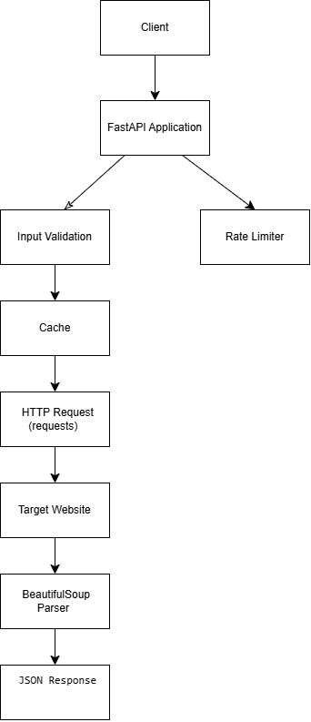

# Architecture Document – Page Pulse

## Overview

Page Pulse is a lightweight website auditing API built using FastAPI. The application accepts a website URL, performs a basic audit, and returns useful information such as page title, meta description, status code, response time, and heading count.

The project was designed with simplicity, maintainability, and production-readiness in mind while satisfying the assignment requirements.

---

# System Architecture

```
Client
   │
   ▼
FastAPI API
   │
   ├── Input Validation (Pydantic)
   ├── Rate Limiting
   ├── Cache Lookup
   │
   ▼
HTTP Request to Target Website
   │
BeautifulSoup HTML Parser
   │
Audit Results
   │
JSON Response
```

---

## Request Flow

1. Client sends a POST request to `/audit`.
2. FastAPI validates the incoming URL using Pydantic.
3. Rate limiting prevents abuse.
4. Cached results are returned if available.
5. Otherwise, the application fetches the target webpage.
6. BeautifulSoup extracts metadata and heading information.
7. Results are returned as JSON.

---

## Design Decisions

### FastAPI

FastAPI was selected because it provides:

- automatic request validation
- automatic OpenAPI documentation
- asynchronous support
- excellent performance

### Caching

Caching reduces repeated requests to the same website, improving response times and reducing unnecessary network traffic.

### Structured Logging

Each request includes logging information to simplify debugging and future monitoring.

---

## Scalability

For larger deployments, I would introduce:

- Redis for distributed caching
- Celery workers for background processing
- PostgreSQL for persistent storage
- Multiple FastAPI instances behind a load balancer

This would allow the service to handle higher traffic while remaining responsive.

---

## Future Improvements

- Asynchronous HTTP client (httpx)
- Redis caching
- Docker deployment
- Prometheus metrics
- Grafana dashboards